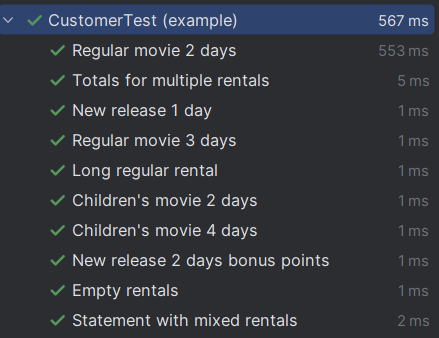

# Spring Boot Refactoring

This project is a refactored version of the classic Movie Rental system, now implemented with **Spring Boot**.  
The goal was to modernize the architecture, make it RESTful, and separate concerns according to Spring best practices.

## Key Changes and Refactoring Done

1. **Migrated the project to Spring Boot**
    - Added Spring Boot parent, starter dependencies, and Maven plugin for easy running.
    - Project now runs as a REST API service.

2. **Introduced layered architecture**
    - **Controller** layer handles REST endpoints (`CustomerController`).
    - **Service** layer contains business logic (`RentalService`).
    - **Model** layer contains data classes (`Customer`, `Movie`, `Rental`, `MovieType`).
    - **Strategy** layer handles pricing logic (`Price`, `RegularPrice`, `NewReleasePrice`, `ChildrensPrice`, `PriceFactory`).
    - **DTOs** (`RentalRequest`, `StatementResponse`) are used for request/response objects.

3. **Separated concerns and refactored logic**
    - Business logic (calculating charges, frequent renter points) moved from `Customer`/Controller to `RentalService`.
    - `Customer` class is now a simple data container.
    - Pricing logic is fully encapsulated in `Price` strategies.

4. **Applied Strategy Pattern**
    - Pricing rules for different movie types are encapsulated in separate classes.
    - Added `PriceFactory` to create the correct strategy based on movie type.
    - Removed all `switch` statements and conditional logic from service/controller.

5. **REST API implemented**
    - POST `/api/rentals/statement` endpoint accepts customer name and list of rentals.
    - Returns total amount and frequent renter points as JSON.

6. **DTOs introduced for API requests/responses**
    - `RentalRequest` represents individual rentals in requests.
    - `StatementResponse` contains aggregated result of the statement.
    - Optional: can extend to `StatementRequest` to wrap customer + rentals in one object.

7. **Updated `pom.xml` for Spring Boot**
    - Added `spring-boot-starter-web` for REST.
    - Added `spring-boot-starter-test` (JUnit 5) for testing.

8. **Rewrote and tested unit tests**
    - Existing JUnit tests were updated for Spring Boot structure.
    - All tests run successfully using `mvn test` or IDE run configuration.
    - Test results:

   